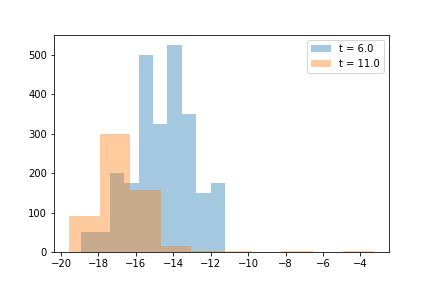

Simulating a Germinal Center Reaction
=====================================

The class :class:`~am_sim.germinal_center` implements the simulation of single `Germinal Centers <https://en.wikipedia.org/wiki/Germinal_center>`_, both for the stochastic and deterministic model. An object of this class is initialized from the dictionary of :ref:`model parameters <par_dict>`, the injected antigen concentration [#f1]_ and the simulation type::

    par = am_sim.st_par()   # model parameters dictionary
    C = 10.                 # antigen concentration
    sim_type = 'stochastic' # simulation type

    GC = am_sim.germinal_center(sim_type, par, C)

The main attributes of a :class:`~am_sim.germinal_center` object is its population of B-cells :attr:`~am_sim.germinal_center.pop`, which is an object of class :class:`~am_sim.stoch_pop` or  :class:`~am_sim.det_pop` depending on the simulation type. Another important atribute is its :attr:`~am_sim.germinal_center.state`, which can be either ``maturing`` if the germinal center is not yet formed, or ``mature``, or ``extinct`` if the germinal center reaction is over. Finally the attribute :attr:`~am_sim.germinal_center.t_days` keeps track of the time in days in the simulation.

The :class:`~am_sim.germinal_center` object is evolved for one evolution round [#f2]_ with the use of the method :meth:`~am_sim.germinal_center.evolve_one_round`. In this example we evolve our germinal center until maturation is reached. At this point we plot the histogram of binding energy. Then we evolve again the germinal center for 10 rounds (5 days) and we plot again this distribution::

    import matplotlib.pyplot as plt

    # evolve time until the germinal center is mature
    while GC.state != 'mature':
        GC.evolve_one_round()

    # plot the histogram of the binding energy distribution of the population
    # (N.b. this is for a stochastic germinal center simulation)
    plt.hist(GC.pop.en, alpha=0.4, label=f't = {GC.t_days}')

    # evolve the germinal center for 20 rounds
    for n_rounds in range(20):
        GC.evolve_one_round()

    # plot the population's binding energy distribution after 20 rounds of evolution
    plt.hist(GC.pop.en, alpha=0.4, label=f't = {GC.t_days}')

    plt.legend()
    plt.show()

We observe that the population's mean binding energy has decreased, or equivalently its average affinity has increased.

:class:`~am_sim.germinal_center` class
______________________________________

This is a non-complete description of the :class:`~am_sim.germinal_center` class. For a more complete description please refer directly to the `code <https://github.com/mmolari/affinity_maturation/blob/master/am_sim/germinal_center.py>`_.

.. currentmodule:: am_sim

.. class:: germinal_center

    This class implements the simulation of a germinal center reaction.

    .. attribute:: pop

        The population of B-cells in the germinal center. This is either a :class:`~am_sim.stoch_pop` or a :class:`~am_sim.det_pop` object, depending on the simulation type.

    .. attribute:: par

        A copy of the model :ref:`parameters dictionary <par_dict>` used to initialize the object.

    .. attribute:: state

        The current state of the germinal center object. This can be either ``maturing``, ``mature`` or ``extinct``.

    .. attribute:: t_days

        The time of the simulation in days.

    .. method:: __init__(GC_type, par, C_inj, [t_inj=0, mc_seed=None])

        Class initializer. It initializes a :class:`~am_sim.germinal_center` object from the simulation type, the :ref:`parameters dictionary <par_dict>` and the injected antigen concentration.

        :param str GC_type: either ``stochastic`` or ``deterministic`` according to the desired simulation type.
        :param dict par: model :ref:`parameters dictionary <par_dict>`.
        :param float C_inj: injected antigen concentration [#f1]_.
        :param float t_inj: optional, time of antigen injection in days. Standard value is 0.
        :param mc_seed: optional, population of memory cells used to seed the germinal centers. If not specified all founder clones are extracted from the naive pool.
        :type mc_seed: :class:`~am_sim.stoch_pop` or :class:`~am_sim.det_pop`, depending on the value of **GC_type**

    .. method:: evolve_one_round()

        Function used to evolve the germinal center for one evolution round.

.. rubric:: Footnotes:

.. [#f1] The conversion between injected antigen dosage (in micrograms) :math:`D` and the antigen concentration :math:`C` is done through the model :ref:`parameter <par_dict>` ``alpha_C`` through :math:`D = \alpha C`.

.. [#f2] The duration of an evolution round is set through the parameter ``days_per_turn``, whose standard value is ``0.5``, that is one evolution round lasts 12 hours.
