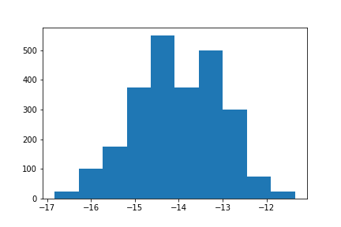
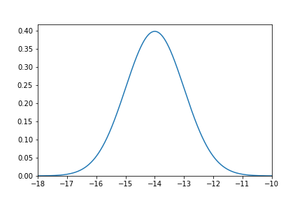

How populations of cells are represented
========================================

Populations of cells are represented in two ways in our simulations, depending if they are the object of our *stochastic* or *deterministic* model. In both cases the defining feature of the population is its distribution of binding energies for the antigen.

The stochastic population class
_______________________________

In the **stochastic simulations** a population of cells is simply a collection of cells, each one characterized by its binding affinity for the antigen. The main attribute of an object of class :class:`~am_sim.stoch_pop` is therefore the list of binding energies of the cells in the population, encoded in the attribute  :attr:`~am_sim.stoch_pop.en`.

We can create a population of cells using a model :ref:`parameters dictionary <par_dict>`. In this case the population of cells is initialized by picking the binding energies of ``par['N_i']`` cells from a normal distribution with mean ``par['mu_i']`` and standard deviation ``par['sigma_i']``::

    # create a parameters dictionary
    par = am_sim.st_par()

    # set the population's size and binding energy distribution mean and variance
    par['N_i'] = 2500
    par['mu_i'] = -14.
    par['sigma_i'] = 1.

    # initialize the population
    pop = am_sim.stoch_pop(par)

One could then plot the population's binding energy distribution with::

    import matplotlib.pyplot as plt

    plt.hist(pop.en)
    plt.show()

The deterministic population class
__________________________________

In **deterministic simulations** the population of cells is instead directly represented by its binding energy distribution and by the population size. The three main attributes of an object of class :class:`~am_sim.det_pop` are the population size :attr:`~am_sim.det_pop.N`, the domain of the binding energy distribution :attr:`~am_sim.det_pop.x` and the values of the distribution on the domain :attr:`~am_sim.det_pop.varphi`.

Similarly to the case of stochastic populations, also deterministic populations can be created from the :ref:`parameters dictionary <par_dict>`::

    # create a parameters dictionary
    par = am_sim.st_par()

    # set the population's size and binding energy distribution mean and variance
    par['N_i'] = 2500
    par['mu_i'] = -14.
    par['sigma_i'] = 1.

    # initialize the population
    pop = am_sim.det_pop(par)

This time the population's binding energy distribution can be plotted using the distribution's domain :attr:`~am_sim.det_pop.x` and the probability distribution function :attr:`~am_sim.det_pop.varphi`::

    import matplotlib.pyplot as plt

    plt.plot(pop.x, pop.varphi)
    plt.xlim(-18,-10)
    plt.ylim(bottom=0)
    plt.show()

The classes :class:`~am_sim.stoch_pop` and :class:`~am_sim.det_pop`
___________________________________________________________________

This is a simple and non-complete list of class attributes for each of the two classes. For a more complete description one can refer directly to the code where the `deterministic <detpop_file_>`_ and `stochastic <stochpop_file_>`_ populations are implemented.

.. currentmodule:: am_sim

.. class:: stoch_pop

    .. attribute:: en

        numpy array containing a list of binding energies of cells in the population.

    .. method:: mean_en

        returns the mean binding energy of the cell population

    .. method:: mean_en_exp

        returns the mean binding energy of the cell population taking into account the :ref:`experimental sensitivity range <exp_range>`.

.. class:: det_pop

    .. attribute:: x

        domain of the population's binding energy distribution.

    .. attribute:: varphi

        population's normalized binding energy distribution.

    .. attribute:: N

        size of the population.

    .. method:: mean_en

        returns the mean binding energy of the cell population

    .. method:: mean_en_exp

        returns the mean binding energy of the cell population taking into account the :ref:`experimental sensitivity range <exp_range>`.

.. _detpop_file: https://github.com/mmolari/affinity_maturation/blob/master/am_sim/pop_deterministic.py

.. _stochpop_file: https://github.com/mmolari/affinity_maturation/blob/master/am_sim/pop_deterministic.py
